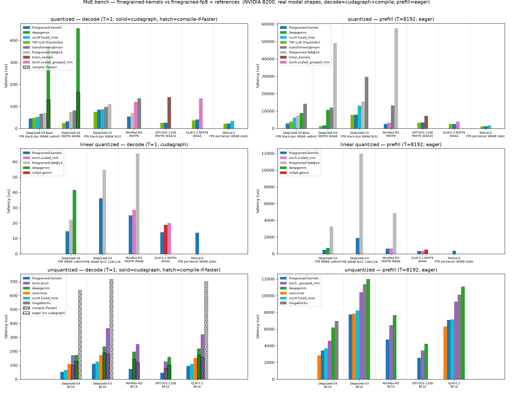

# finegrained-kernels

Triton GEMM + MoE kernels for fine-grained quantization — block/tensor FP8, MXFP8, MXFP4, and
two-level NVFP4 weights, with fused gate|up GLU epilogues, fused intermediate requantization, and
expert routing — developed as part of the HuggingFace Transformers FP8 + MoE optimization effort.

All tuning and validation is on NVIDIA Blackwell (SM100 / B200), whose tcgen05 scaled-MMA the MX
paths target; Hopper (SM90) runs the same Triton paths, and ROCm / XPU backends are built but
unvalidated.

## Benchmarks



Real model shapes on an NVIDIA B200, against upstream `finegrained-fp8`, DeepGEMM, transformers
`grouped_mm`/`batched_mm`, SonicMoE, OpenAI `triton_kernels`, and `torch.scaled_grouped_mm`.
Decode is cudagraph-captured, prefill eager; a red ✕ marks a configuration that raised. Every
baseline's output is parity-checked against the finegrained-kernels anchor in the same run. See
[`bench/README.md`](bench/README.md) to reproduce.

## Public API

Three GEMM dispatchers, the two fused MoE forwards, and the load-time helpers:

```python
from finegrained_kernels import (
    matmul_2d, matmul_batched, matmul_grouped,           # GEMM dispatchers
    moe_fused_batched, moe_fused_grouped,                # fused MoE forwards
    swizzle_mx_scales, unswizzle_mx_scales,              # weight scales <-> tcgen05 layout, at load
    mxfp8_act_quant, mxfp4_act_quant, nvfp4_act_quant,   # row-wise group quantizers (weights at load, activations offline)
    get_supported_act_fns,                               # GLU activations the fused epilogue implements
)
```

The unfused two-GEMM references (`moe.moe_unfused_*`), the cuBLAS baseline (`moe.moe_torch_grouped`),
`scheduling.compute_grouped_scheduling` and the block/tensor fp8 and two-level NVFP4 quantizers stay
importable from their modules.

### GEMM dispatchers

Every op takes the same operand spec and routes to the right kernel **from the weight dtype and
scale shape** — the format falls out of the data, so it can never disagree with a parameter:

```python
matmul_2d(A, B, As=None, Bs=None, *, activation_format=None, gate=False, act_fn="silu",
          swiglu_alpha=None, swiglu_limit=None, quantize_output=False, output_dtype=None,
          a_global_scale=None, b_global_scale=None, output_global_scale=None)
matmul_batched(A, B, As, Bs, *, expert_ids, gather_idx=None, scatter_idx=None, ...same keywords...)
matmul_grouped(A, B, As, Bs, *, expert_start, gather_idx=None, scatter_idx=None, ...same keywords...)
```

- `A` `(M, K)` activations — raw bf16/fp16/fp32 (the op quantizes inline or offline as the format
  needs) or pre-quantized with `As`.
- `B` weights — `(N, K)` for `matmul_2d`, `(E, N, K)` for the routed ops. `Bs` selects the format
  (see the format matrix below).
- `activation_format` is the activations' quantization, in the same vocabulary as transformers'
  `FineGrainedConfig`: `None` (default) = the weights' own format, `"bf16"` = weight-only (W4A16 /
  W8A16), or an explicit `"fp8"` / `"mxfp8"` / `"mxfp4"` / `"nvfp4"` (`"mxfp8"` on MXFP4 weights =
  the W4A8 chain). The weight format is never named — it is read off `B`/`Bs`.
- `gate=True, act_fn="silu", swiglu_alpha=..., swiglu_limit=...` fuses the gate|up GLU: `B` holds
  the stacked `(2N, K)` gate|up rows and the op returns the activated `(M, N)` intermediate;
  `quantize_output=True` stores it in `activation_format` for the next op (a `(C, Cs)` tuple is
  returned instead of a dense tensor).
- `a_global_scale` / `b_global_scale` / `output_global_scale` are the NVFP4 second level, fp32
  globals folded onto the accumulator: one value for the tensor, or `(E,)` per expert. A
  per-expert `a_global_scale` needs rows that belong to one expert each: `matmul_batched` reads
  the row's expert id, and `matmul_grouped` requires expert-sorted rows (`gather_idx=None`). A
  gate|up stack whose halves a checkpoint calibrated separately carries one global per half; the
  loader merges those into one per expert (the up half's folds into the down projection's global,
  SwiGLU being linear in it) rather than the ops taking a second layout.
- Routing: `matmul_batched` reads one expert id per row (`expert_ids`, EP sentinels
  `>= num_experts` skipped); `matmul_grouped` takes the launch maps from
  `compute_grouped_scheduling(expert_ids, num_experts, top_k)` — no pre-sorted input required.

### Weight format matrix

| format | `B` dtype | `Bs` | second level |
| --- | --- | --- | --- |
| full precision | bf16 / fp16 | `None` | — |
| block FP8 (128×128) | `float8_e4m3fn` | fp32 or UE8M0 `(⌈N/128⌉, K/128)` (the block is derived from the K dim, so K must divide) | — |
| tensor FP8 | `float8_e4m3fn` | one scalar | — |
| MXFP8 | `float8_e4m3fn` | UE8M0 `(N, K/32)` (raw `uint8` accepted) | — |
| MXFP4 | packed E2M1 (`int8`, 2/byte) | UE8M0 `(N, K/32)` | — |
| NVFP4 | packed E2M1 (`int8`, 2/byte) | E4M3 `(N, K/16)` | fp32 global(s) |

Routed ops carry the expert dim in front (`(E, ...)` weights and scales). MX scales may instead be
passed **pre-swizzled** — the 5D output of `swizzle_mx_scales` — which is the deployment contract:

```python
Bs5d = swizzle_mx_scales(Bs)                 # (N, K/g) or (E, N, K/g) -> the tcgen05 layout
gate_up_s = swizzle_mx_scales(gate_up_s, gate=True)   # stacked (E, 2I, H/g) gate|up slabs
```

Swizzle once at model load; the ops read the SWIZZLE_32_4_4 descriptor fast path directly (plain
row-major scales work everywhere but gather per group, capping the scaled dot below peak). A
pre-swizzled gate_up scale is ONE artifact — gate-interleaved (``gate=True``), returned 6-D so the
shape carries the layout — and every path consumes it directly: the fused kernels read a tile's
gate + up block pair off the descriptor, and a plain (unfused) GEMM remaps its block index
in-kernel. No de-interleaving, no per-path copies. One exception: the weight-only ops
(`activation_format="bf16"`, W4A16/W8A16) read affine scales only — keep the row-major scale around if that
path must run.

### MoE forwards

```python
out = moe_fused_grouped(          # prefill; moe_fused_batched is the decode sibling
    hidden_states,                # (T, H)
    top_k_index, top_k_weights,   # (T, K) routing (EP sentinels >= num_experts skipped)
    gate_up_proj,                 # (E, 2I, H)
    down_proj,                    # (E, H, I)
    gate_up_proj_scale_inv, down_proj_scale_inv,
    gate_up_proj_weight_global_scale=None,    # NVFP4 weight second level, per expert
    down_proj_weight_global_scale=None,
    gate_up_proj_input_global_scale=None,     # the checkpoint's calibrated activation input_scale
    down_proj_input_global_scale=None,
    act_fn="silu", swiglu_alpha=None, swiglu_limit=None,
    post_expert_norm=None,        # per-expert output norm: a get_supported_norms() name, or a callable
    post_expert_norm_weight=None, post_expert_norm_eps=1e-6,
    activation_format=None,       # activation quant for the whole block; None = the weights' format, "bf16" = bf16 acts
)
```

The fused forwards run gate_up + GLU + intermediate requant + down + routing-weighted top-k reduce
in two GEMM launches; `moe_unfused_*` are the two-GEMM + host-GLU references (bit-comparable via
`simulate_unfused=True`), and `moe_torch_grouped` is the `torch.scaled_grouped_mm` (cuBLAS)
baseline. `activation_format=None` follows the weight format; `"mxfp8"` on MXFP4 weights gives the
W4A8 chain; `"bf16"` keeps activations bf16 (weight-only W4A16/W8A16). For calibrated NVFP4 checkpoints the
per-projection `input_scale` rides as `*_input_global_scale`: the gate_up quantizes hidden against
its own, requants the intermediate against the down's, and the down consumes it — leave them `None`
for dynamic quant. The gate_up's is one value (its rows are the hidden states, quantized once
before routing); the down's may be per expert, since its rows are.

`post_expert_norm` covers models that norm the down output before the routing weights. It runs on
the routed rows — one row per expert application, where such a norm is defined. A
`get_supported_norms()` name (`"rms_norm"`, `"centered_rms_norm"` scaling by `1 + weight`, or
`"input_scaled_rms_norm"` scaling before normalizing) plus `post_expert_norm_weight` is FUSED: one
pass computes each row's `rsqrt` and the reduce the chain already runs applies it with the column
factor, so the normalized rows are never materialized. Anything else is a host callable applied to
the rows. `rms_norm_rows` exposes the standalone kernel.

### Load-time quantization helpers

`nvfp4_quantize_two_level(weight)` returns `(packed_e2m1, e4m3_block_scales, fp32_global)` — the
canonical two-level NVFP4 weight quant (`global = amax / (6·448)`). The `*_act_quant` helpers are
the offline activation quants the ops use internally, exposed for pre-quantized (`As`) pipelines;
`fp8_act_quant_block_dynamic` / `fp8_act_quant_tensor_wide` are their block-FP8 siblings.

## Autotuning

Every kernel is tuned by a TPE (Bayesian) autotuner with per-shape disk caching, config pruners
that fence compiler bugs and can't-win regions per (arch, format), and failed-compile memoization.
`FINEGRAINED_AUTOTUNE_TRIALS` overrides the trial budget; `FINEGRAINED_AUTOTUNE_LOG=<path>` appends
per-config timings as JSONL to `<path>`.

## Tests

`pytest tests/` — op-level scenarios against an independent dequantize-and-matmul torch oracle
(`tests/test_ops.py`), fused-vs-unfused MoE parity (`tests/test_moe.py`), quant-helper references
(`tests/test_act_quant.py`), and autotuner/pruner guards (`tests/test_autotuner.py`). `pytest -n 8`
pins one GPU per xdist worker. `-m "not slow"` skips the multi-process determinism and
forced-config sweep tests.
